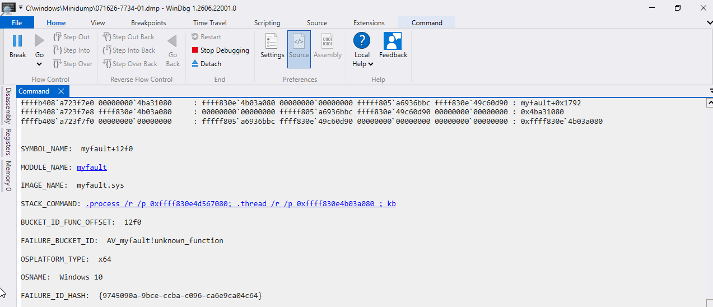

# BSOD and Crash-Dump Analysis

## Overview

This project simulated a genuine Windows crash and analysed the resulting memory dump.

Microsoft Sysinternals **NotMyFault** was used to deliberately trigger a stop error, and **WinDbg** was then used to identify the faulting driver from the generated minidump.

## Diagnosis

Small memory dumps were enabled in **Startup and Recovery** so Windows would save crash data to:

`C:\Windows\Minidump`

A crash was then triggered using **NotMyFault** with the **High IRQL fault (Kernel-mode)** option.

Windows displayed the stop error:

`DRIVER_IRQL_NOT_LESS_OR_EQUAL (0xD1)`

The crash screen identified:

`myfault.sys`

The generated minidump was opened in **WinDbg** and analysed with `!analyze -v`, which confirmed:

- `MODULE_NAME: myfault`
- `IMAGE_NAME: myfault.sys`

## Resolution

Because the crash was intentionally generated for testing, the objective was not to repair Windows but to confirm that the crash could be:

- triggered in a controlled way
- captured as a minidump
- analysed to identify the faulting driver

After the analysis, the VM was restarted normally.

## Skills Demonstrated

- BSOD troubleshooting
- Stop-code identification
- Memory-dump configuration
- Minidump analysis
- WinDbg usage
- Faulting-driver identification

## Screenshots

### Memory Dump Configuration

### NotMyFault Crash Selection

### Windows Stop Error

### WinDbg Crash Analysis

